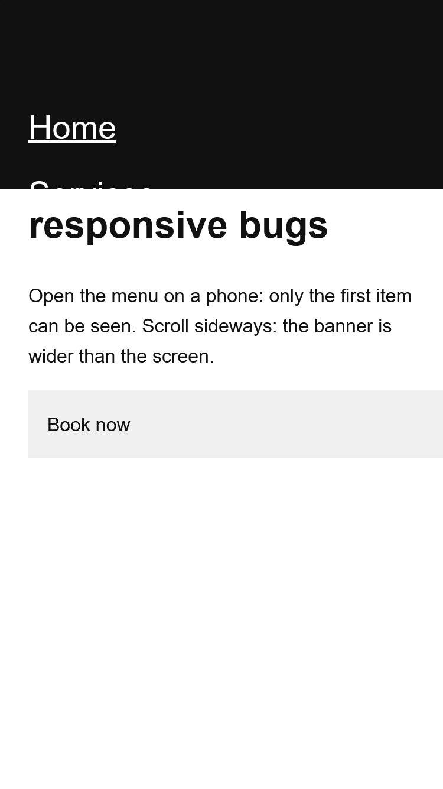
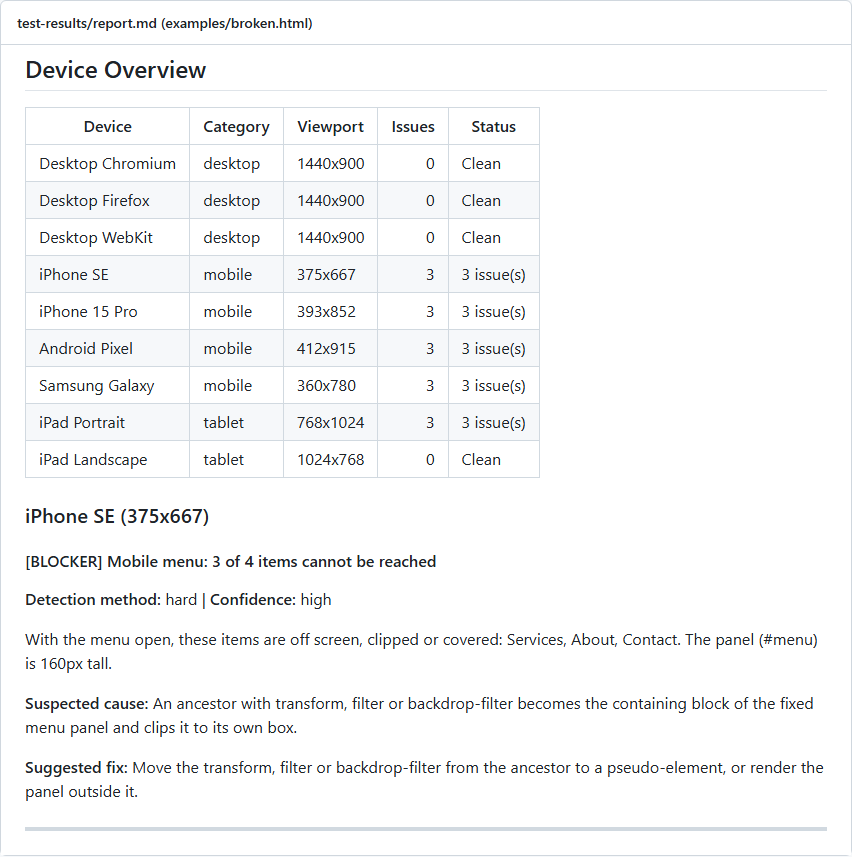

# Viewport Sentinel

[](https://github.com/massimomazzariol/Viewport-Sentinel/actions/workflows/ci.yml)
[](https://github.com/massimomazzariol/Viewport-Sentinel/releases/latest)
[](https://nodejs.org)
[](https://playwright.dev)
[](LICENSE)

A small command-line check for the responsive bugs that screenshots and unit tests miss. It opens one page on 9 devices in real Chromium, Firefox and WebKit and reports:

- **Horizontal scroll** and the elements that cause it
- **Edge leaks**: a light strip along the right edge of the screen
- **Clipped shadows** inside `overflow: hidden` parents (heuristic)
- **Mobile menus you cannot use**: it opens the menu and checks that every item is on screen and not clipped or covered



That last check exists because of a real bug: a header with `backdrop-filter` becomes the containing block of the fixed menu inside it, so the full-screen menu is cut down to the header's height. Only the first item shows, nothing errors, and it looks fine on desktop.

It is a micro project: one page per run, no configuration file, a Markdown and JSON report, an exit code for CI.

## Run

Node.js 20.12 or later:

```sh
git clone https://github.com/massimomazzariol/Viewport-Sentinel
cd Viewport-Sentinel
pnpm install
pnpm exec playwright install chromium firefox webkit

node src/cli.js --url https://example.com
```

| Option | |
| --- | --- |
| `--url`, `-u` | Page to scan: `http(s)://` or `file://`. Or `SITE_URL` in the environment or a `.env` file |
| `--strict`, `-s` | Lower thresholds: more sensitive, more false positives |
| `--debug`, `-d` | Outline every element and save extra screenshots |
| `--headed` | Show the browsers |
| `--out` | Output folder, default `test-results` |

Exit code `0` clean, `1` blocker or high issues, `2` configuration error.

## Output

`test-results/report.md`, `report.json` and screenshots: full page per device, plus the menu closed and open on phones and tablets.



Try it on the two example pages, the same page with and without the bugs (`pnpm test` does exactly this):

```sh
node src/cli.js --url file:///path/to/Viewport-Sentinel/examples/broken.html
node src/cli.js --url file:///path/to/Viewport-Sentinel/examples/fixed.html
```

## Limits

- One URL per run.
- Edge leak and shadow clipping are heuristics: read them as hints.
- The menu check finds toggles by common selectors (`src/detectors/menu-toggles.json`); custom markup may need one more selector there.

## License

Apache-2.0. Copyright 2026 Massimo Mazzariol, [https://github.com/massimomazzariol/Viewport-Sentinel](https://github.com/massimomazzariol/Viewport-Sentinel). If you reuse or redistribute it, keep the [NOTICE](NOTICE) file: that is how you credit the original project.
